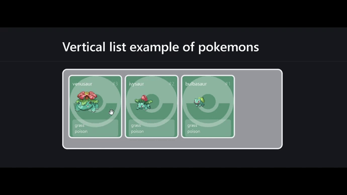

 <h1 align="center">
    
  <br>vue-fluid-dnd<br>
</h1>

A **fluid**, **smooth**, **versatil** and **lightweight** drag and drop
library for lists on Vue3.



## ✨ Features

- ✅ **Fully customizable 🎨**.
- ✅ **Zero dependencies 🪶**.
- ✅ **Work with horizontal➡️and vertical list :arrow_down:**.
- ✅ **Mouse 🐭 and touch 👉📱 (mobile, tablet and so on) support**.
- ✅ **Nice documentation 📑 and examples**.
- 🔲 **Fully tested 🧪, typed and reliable**.

## 🚀 Getting Started

1. **Install vue-fluid-dnd:**

   ```bash
   # with npm:
   npm i vue-fluid-dnd

   # with yarn:
   yarn add vue-fluid-dnd

   # with pnpm:
   pnpm i vue-fluid-dnd

   # with ultra:
   ultra install vue-fluid-dnd
   ```

2. **Import components and styles**

   ```js
   import { Draggable, Droppable } from "vue-fluid-dnd";
   import "vue3-fluid-dnd/style.css";
   ```

3. **Create a list that your want to sort**

   ```js
   // Each element have its own styles or classes and the draggable-id
   const listToSort = ref([
     {
       "draggable-id": "h1",
       number: 1,
       style:
         "color: white; background-color: red; width: 50px; margin: 23px 0;",
     },
     //...
   ]);
   ```

4. **Use the components**

   ```jsx
   //pass setRef to child to have the reference of draggable element
   //pass the direction of the list and droppable id
   <Droppable droppable-id="droppable-id" direction="vertical" :items="list1">
      <div style="width: 40%; background-color: darkgray; display: block">
         <Draggable
         v-for="(element, index) in listToSort"
         v-slot="{ setRef }"
         :draggable-id="element['draggable-id']"
         :index="index"
         >
         <div :ref="setRef" :style="element.style">{{ element.number }}</div>
         </Draggable>
      </div>
   </Droppable>
   ```

- 📚 [All docs here](https://vue-fluid-dnd.netlify.app/).

## 🤝 Contributing

If you're interested in contributing to vue-fluid-dnd, please read our contributing docs before submitting a pull request [CONTRIBUTING](./CONTRIBUTING.md).

<!-- TODO: add test with playwright https://github.com/formkit/drag-and-drop -->
<!-- TODO: put the vue examples in a another folder and add tests -->
